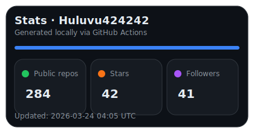
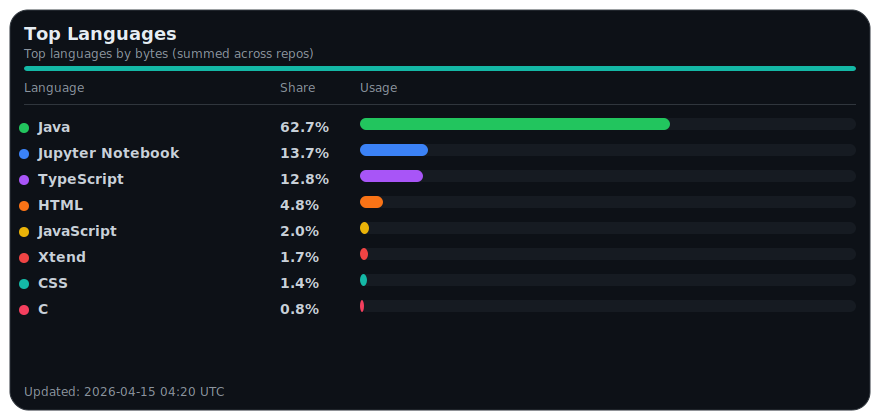
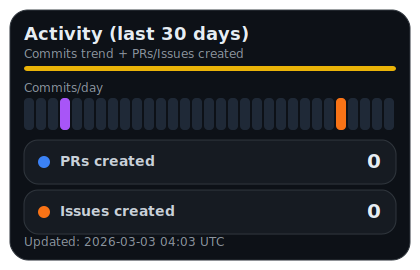

# Hi there👋

26.06.2024 Kein Sieg aber ein Lichtblick für die Demokratie und Meinungsfreiheit - Julian Assange ist frei. 

Klick auf das folgende Bild startet das Video eines ZDF Interviews dazu. 

Picture: (CC BY-NC-ND 2.0 DEED) https://creativecommons.org/licenses/by-nc-nd/2.0/ by Antonio Marín Segovia at https://flic.kr/p/2fEnF8q

21.02.2024 Aktuell entscheidet ein Londoner Gericht über die Auslieferung von Julian Assange. Schon die Inhaftierung von Julian Assange und dessen Gleichsetzung mit einem Kriminiellen ist ein herber Rückschlag für die Menschenrechte, doch seine Auslieferung würde eine Bankrotterklärung der westlichen Welt und ihrer Werte bedeuten. 

Weltweit gibt es zahlreiche Petitionen gegen die Auslieferung von Julian Assange, diese hier ist nur ein Beispiel:
https://www.change.org/p/verhindert-die-auslieferung-von-julian-assange-an-die-usa

Wer nicht weiß wovon ich hier schreibe, der ist entweder einfach sehr jung oder sehr wohl behütet aufgewachsen. Für Aufklärung sorgt dieses Video - doch Vorsicht auch Satire muss in einzelnen Nebensätzen verstanden werden:
https://www.youtube.com/watch?v=SF_bP-tAyeU

Wer lieber ein kommentiertes Original ansehen will, dem kann hier geholfen werden:
https://www.youtube.com/watch?v=HfvFpT-iypw

Wer die Hintergründe ausführlich erläutert haben möchte, hier eine Doku über Julian Assange aus dem Jahre 2020:
https://www.youtube.com/watch?v=NQrz-J8R9zA

Der Vollständigkeit halber noch der Hinweis auf einen kurzen Beitrag zu Chelsea Manning (vormals Bradley Manning) welcher damals der Informant des Leaks war: https://www.youtube.com/watch?v=UVxITlA78hE

# Now to me👋

You can read private notes about me at my [homepage](https://huluvu424242.github.io/home/) or github activities at these page.

My open source targets i managed at <a target="_blank" href="https://opensauced.pizza/">opensauced.pizza</a>

Looking for hacktoberfest coding: <a target="_blank" href="https://github.com/search?q=label:hacktoberfest+state:open+type:issue">solve issues</a>

<a target="_blank" href="https://hacktoberfestchecker.jenko.me/user/Huluvu424242">Currently Hacktoberfest PRs</a>

---

## :fire: My Stats : <a href="https://github.com/Huluvu424242">

<!--script 
    type="module" 
    src='https://unpkg.com/@huluvu424242/honey-chucknorris-jokes@0.0.1/dist/honey-chucknorris-jokes/honey-chucknorris-jokes.js'>
</script>
<honey-chucknorris-jokes /-->

## :zap: My Recent Activity

<!--START_SECTION:activity-->
1. 🎉 Merged PR [#12](https://github.com/PIUGroup/homeserver-hogerer/pull/12) in [PIUGroup/homeserver-hogerer](https://github.com/PIUGroup/homeserver-hogerer)
2. 💪 Opened PR [#12](https://github.com/PIUGroup/homeserver-hogerer/pull/12) in [PIUGroup/homeserver-hogerer](https://github.com/PIUGroup/homeserver-hogerer)
3. 🎉 Merged PR [#3](https://github.com/Huluvu424242/homeserver-hogerer/pull/3) in [Huluvu424242/homeserver-hogerer](https://github.com/Huluvu424242/homeserver-hogerer)
4. 💪 Opened PR [#3](https://github.com/Huluvu424242/homeserver-hogerer/pull/3) in [Huluvu424242/homeserver-hogerer](https://github.com/Huluvu424242/homeserver-hogerer)
5. 🎉 Merged PR [#11](https://github.com/PIUGroup/homeserver-hogerer/pull/11) in [PIUGroup/homeserver-hogerer](https://github.com/PIUGroup/homeserver-hogerer)
6. 💪 Opened PR [#11](https://github.com/PIUGroup/homeserver-hogerer/pull/11) in [PIUGroup/homeserver-hogerer](https://github.com/PIUGroup/homeserver-hogerer)
7. 🎉 Merged PR [#10](https://github.com/PIUGroup/homeserver-hogerer/pull/10) in [PIUGroup/homeserver-hogerer](https://github.com/PIUGroup/homeserver-hogerer)
8. 💪 Opened PR [#10](https://github.com/PIUGroup/homeserver-hogerer/pull/10) in [PIUGroup/homeserver-hogerer](https://github.com/PIUGroup/homeserver-hogerer)
9. ❗ Opened issue [#2249](https://github.com/ipfs/ipfs-docs/issues/2249) in [ipfs/ipfs-docs](https://github.com/ipfs/ipfs-docs)
10. 🎉 Merged PR [#27](https://github.com/Huluvu424242/FluentBuilder.example/pull/27) in [Huluvu424242/FluentBuilder.example](https://github.com/Huluvu424242/FluentBuilder.example)
<!--END_SECTION:activity-->

   
  
 <h2>🌱 My Trainings</h2> (click to see more)

--- 

<!--
**Huluvu424242/huluvu424242** is a ✨ _special_ ✨ repository because its `README.md` (this file) appears on your GitHub profile.

Here are some ideas to get you started:

- 🔭 I’m currently working on ...
- 🌱 I’m currently learning ...
- 👯 I’m looking to collaborate on ...
- 🤔 I’m looking for help with ...
- 💬 Ask me about ...
- 📫 How to reach me: ...
- 😄 Pronouns: ...
- ⚡ Fun fact: ...
-->
